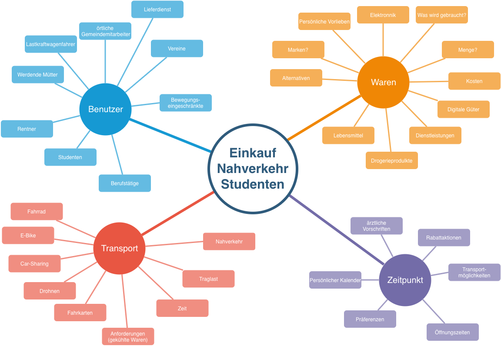

# Assignment 0

Jonas Szalanczi 1258437, Marcel Fraas 1324785

## Projektbeschreibung

Studenten besitzen selten aufgrund des knappen Geldbeutels kein Auto. In mittelgroßen Stödten sind die öffentlichen Verkehrsmittel noch nicht richtig ausgebaut. Mithilfe von "Shoppy" können Nutzer anhand ihrer Bedürfnisse beim Einkauf, den von ihrer aktuellen Position, den durch öffentliche Verkehrsmittel angebunden Supermarkt erreichen. Die mobile Anwendung illustriert auf einer Karte Haltestelle, Supermärkte und Laufwege.

## Anzahl der Design Iterationen

Wir kalkuieren für unser Projekt einen Entwicklungszeitraum von 2 Monaten. Innerhalb dieses Zeitraums werden wir das Projekt in 2 Phasen aufgliedern. Jede Phase besteht aus einem guten Monat und beeinhaltet wöchentliche Treffen. Sinn und Inhalt dieser wöchentlichen Treffen ist es einen engen Feedbackloop vor allem mit den zukünftigen Nutzern und der Übungstreffen zu schaffen. So können wir agil auf Änderungen oder Wünsche reagieren.

## Methoden der Datenerhebung

- Aufarbeitung der OpenStreetMaps Dokumentation zum Auslesen von:
  * Ortsdaten von Supermärkten
  * Ortsdaten von öffentlichen Nahverkehrshaltestelle in GPS-Form
- Auswertung der Informationen aus Interviews mit Konsumenten bezüglich:
  * Wünsche an die Benutzbarkeit
  * Darstellung geographischer Informationen (Karte / Route)
  * Möglichkeiten der täglichen Integration in den Benutzertagesablauf (Mobilapp)
- Gruppenbrainstorming zur offenen Diskussion
- 
## Design Methoden

## Typen von Prototypen

## Evaluationsmethoden

Mit den Start des Projekts: Idee Evaluation mit potentiellen Kunden

